# LTV Assistant – Architecture Diagrams (2025 Refresh)

This document contains updated diagrams reflecting the current platform architecture. All graph-database integrations have been retired; the system now relies on MySQL for metadata and Qdrant for vector search.

## 1. Platform Overview

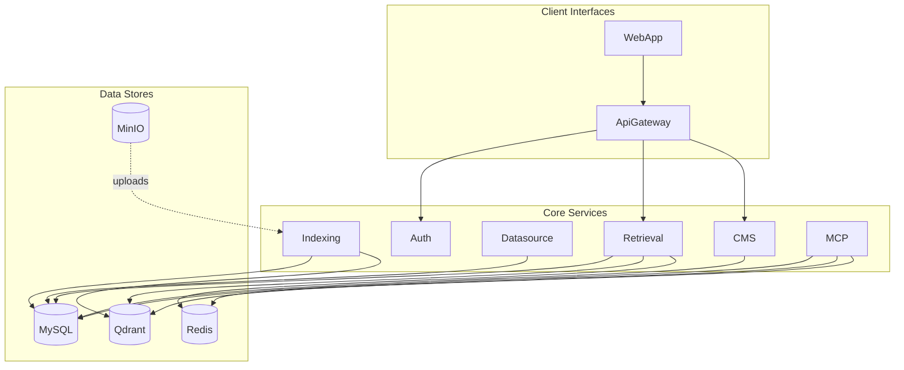

## 2. Indexing Pipeline

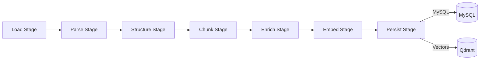

## 3. Retrieval Workflow (LangGraph)

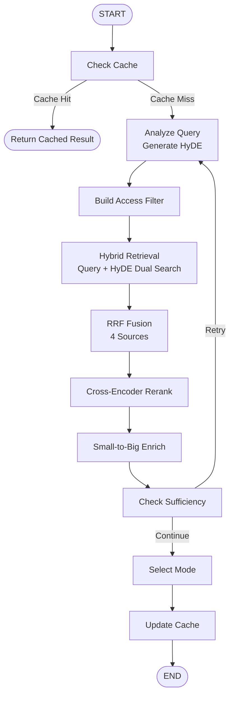

## 4. Observability Stack

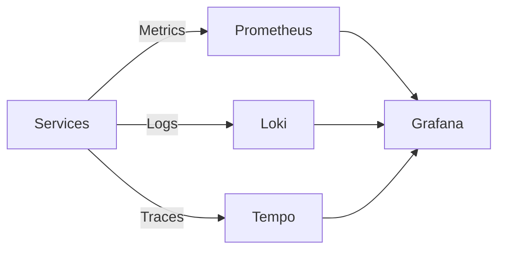

## 5. Complete Retrieval Workflow (LangGraph StateGraph)

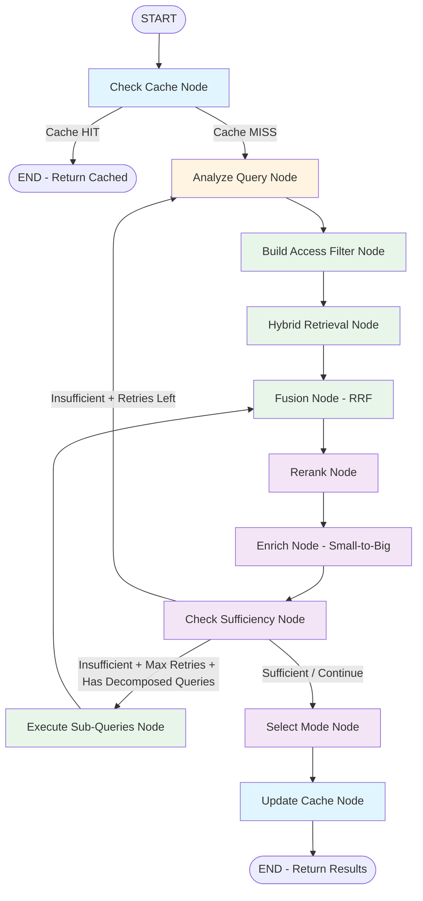

## 6. Query Transformation Stage (Parallel Execution)

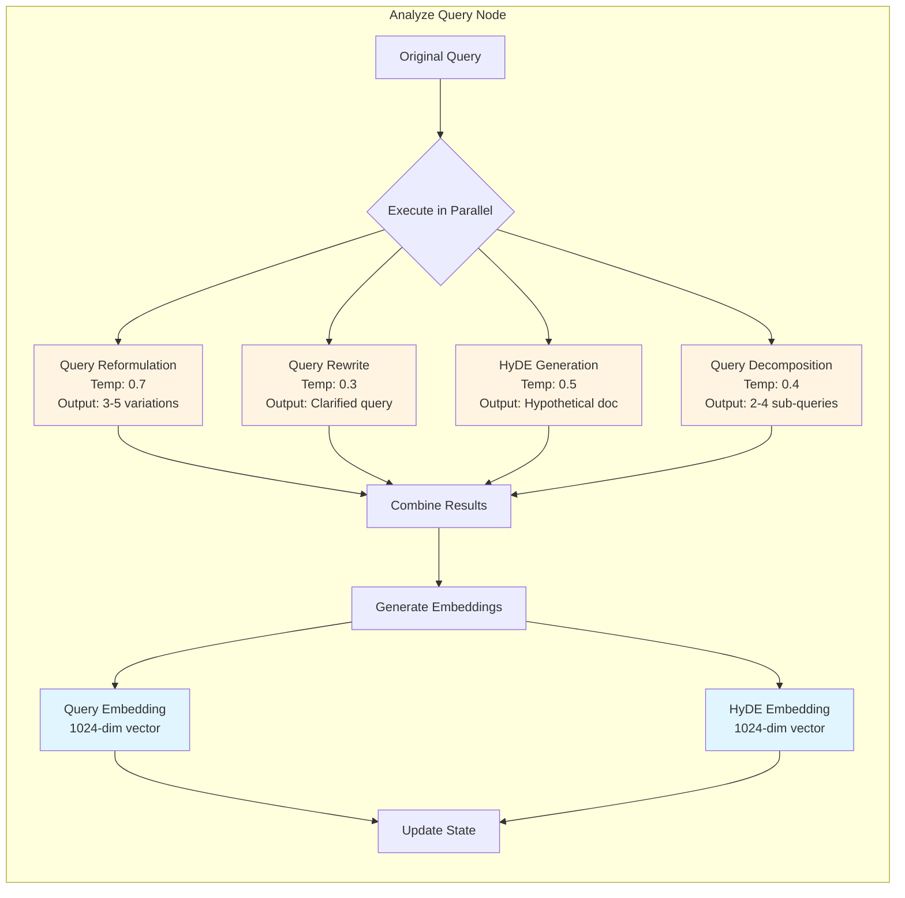

## 7. Hybrid Retrieval Pipeline (Multi-Source + HyDE)

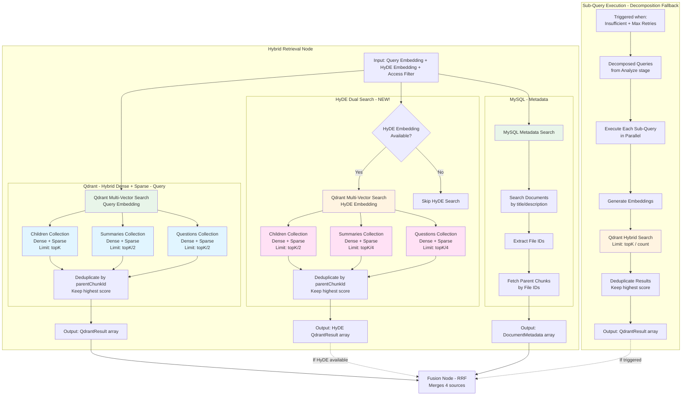

## 8. Reranking & Enrichment Pipeline

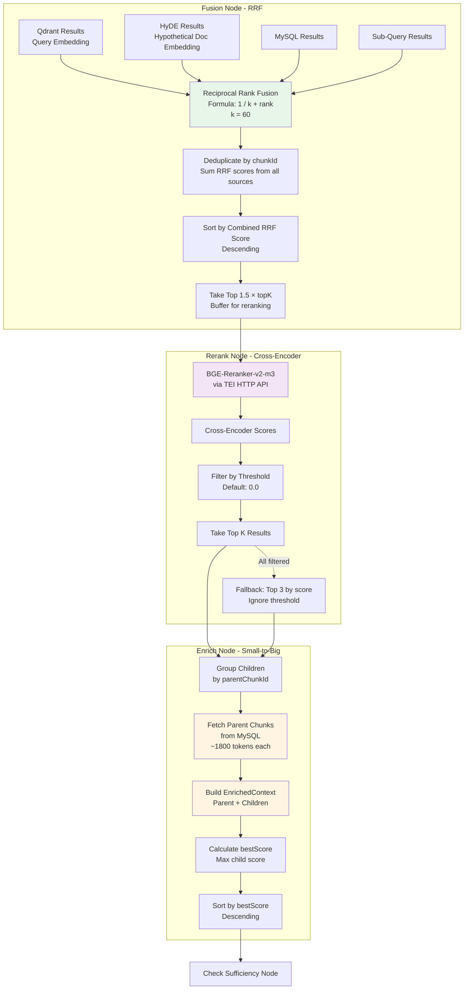

## 9. Adaptive Loop & Sufficiency Decision

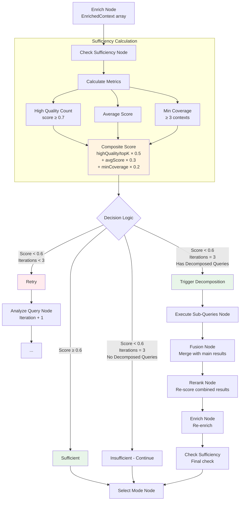

## 10. Semantic Cache Flow (Phase 1.5)

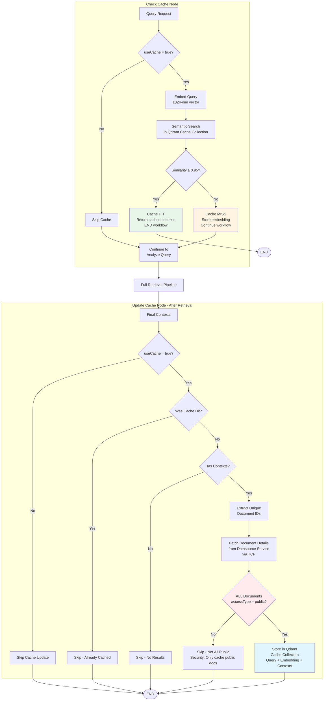

## 11. Service Architecture & Dependencies

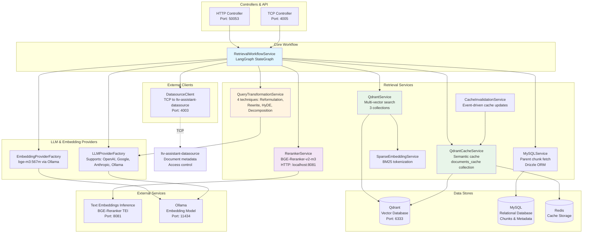

---
*Diagrams last updated: 2025-11-14*
*HyDE dual search added: 2025-11-14*
