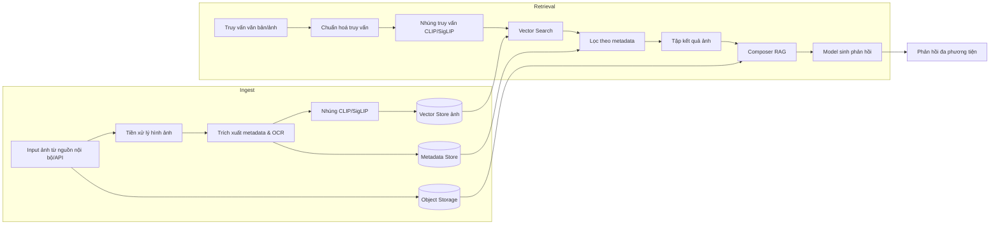
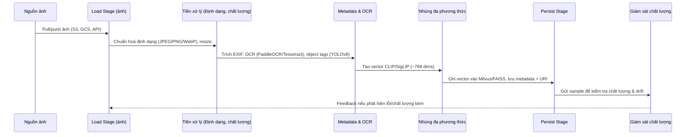
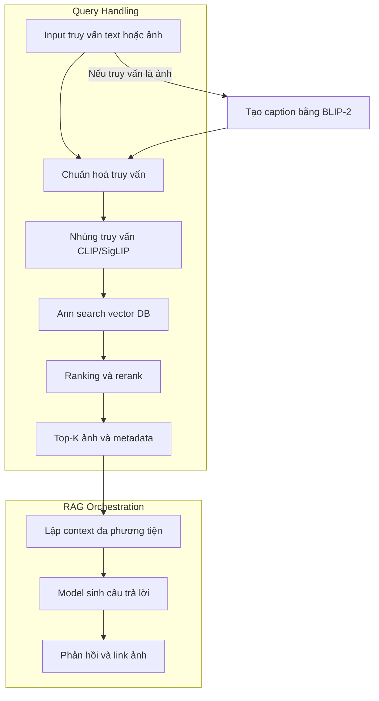

# Kế hoạch tích hợp xử lý & tìm kiếm hình ảnh trong hệ thống RAG

## 1. Bối cảnh & mục tiêu
- **Bối cảnh**: Hệ thống hiện tại đã có pipeline RAG cho tài liệu văn bản (các stage `load` → `parse` → `structure` → `chunk` → `embed` → `persist` → `retrieval`). Việc mở rộng sang dữ liệu hình ảnh giúp đáp ứng nhu cầu đa phương tiện của khách hàng và giảm phụ thuộc vào văn bản thuần.
- **Mục tiêu**: 
  - Bổ sung khả năng ingest, xử lý và truy xuất hình ảnh theo nội dung.
  - Cho phép truy vấn đa phương thức (văn bản ↔ ảnh, ảnh ↔ ảnh, ảnh ↔ văn bản) trong cùng một hệ RAG.
  - Đảm bảo khả năng vận hành sản xuất: hiệu năng < 1.5s mỗi truy vấn, độ chính xác truy xuất top-5 ≥ 0.75 mAP, chi phí lưu trữ/CPU/GPU trong ngưỡng ngân sách hiện tại.
- **Yêu cầu liên quan**: Tận dụng hạ tầng sẵn có (Airflow/Prefect cho pipeline, object storage S3 compatible, vector store hiện tại), đảm bảo tuân thủ chính sách riêng tư dữ liệu hình ảnh.

## 2. Nguyên tắc thiết kế
- **Tách biệt pipeline ingest và pipeline truy vấn** để dễ mở rộng và tối ưu độc lập.
- **Chuẩn hoá metadata** (EXIF, labels, OCR text) nhằm hỗ trợ cả filter-based retrieval lẫn semantic retrieval.
- **Dùng mô hình nhúng đa phương thức chuẩn hóa** (CLIP hoặc SigLIP) để ánh xạ văn bản và ảnh vào cùng không gian vector.
- **Lựa chọn kiến trúc modular**: mỗi stage (tiền xử lý, nhúng, lưu trữ) đóng gói trong service riêng, triển khai dưới dạng container.
- **Giám sát & đánh giá liên tục** với bộ dataset chuẩn (golden set) và pipeline RAGAS cho ảnh.

## 3. Kiến trúc tổng thể

## 4. Luồng ingest hình ảnh đa tầng

## 5. Luồng truy vấn đa phương thức tại runtime

## 6. Hạng mục công nghệ đề xuất
| Thành phần | Công nghệ ưu tiên | Ghi chú lựa chọn |
| --- | --- | --- |
| Tiền xử lý | OpenCV, libvips | libvips giúp batch và memory friendly |
| OCR | PaddleOCR (multilingual) | Hỗ trợ tiếng Việt tốt, GPU optional |
| Object detection | YOLOv8 / GroundingDINO | Gán nhãn đối tượng phục vụ filter |
| Nhúng | OpenCLIP (ViT-H/14) hoặc SigLIP | Đã open-source, hiệu quả trên ảnh đa dạng |
| Vector store | Milvus / Weaviate (production) | Có hỗ trợ hybrid search, PQ/IVF |
| Metadata store | PostgreSQL + pgvector hoặc Elasticsearch | Lưu tag, EXIF, text |
| Orchestrator | Prefect/Airflow + Argo Workflows | Tương thích pipeline hiện có |
| Serving LLM | GPT-4o, Llama 3.2 Vision | Tuỳ yêu cầu on-prem hay SaaS |
| Monitoring | Evidently, Weights & Biases | Theo dõi drift embedding & chất lượng |

## 7. Lộ trình triển khai (dự kiến 12 tuần)
| Sprint | Goals chính | Deliverables |
| --- | --- | --- |
| 0 (2 tuần) | Khảo sát, POC nhỏ | Benchmark CLIP, validate vector DB với 10k ảnh |
| 1 (2 tuần) | Mở rộng ingest | Pipeline `load`/`parse` cho ảnh, lưu object storage |
| 2 (2 tuần) | Metadata & OCR | Dịch vụ trích metadata + OCR, schema chuẩn |
| 3 (2 tuần) | Embedding & indexing | Service nhúng, tích hợp Milvus + replication |
| 4 (2 tuần) | Retrieval runtime | API truy vấn ảnh ↔ văn bản, reranker |
| 5 (2 tuần) | Tích hợp RAG + QA | Kết nối composer hiện tại, A/B test, tài liệu SOP |

## 8. Chi tiết công việc theo stage hiện tại
### 8.1. Load Stage (mở rộng cho ảnh)
- Bổ sung connector ingest ảnh từ API nội bộ, bucket S3, upload thủ công.
- Chuẩn hóa naming convention: `images/{source}/{yyyy}/{mm}/{uuid}.webp`.
- Thiết lập validate kích thước (>= 256px) và định dạng (JPEG, PNG, WebP).

### 8.2. Parse & Structure Stage
- Parse: Trích metadata, convert sang JSON schema chuẩn (`image_id`, `source`, `labels`, `exif`, `ocr_text`, `caption`).
- Structure: Chuẩn hóa taxonomy nhãn (dùng ontology bên `enrich-stage.md`), map về controlled vocabulary.
- Lưu trữ metadata tạm thời trong PostgreSQL để kiểm thử.

### 8.3. Chunk & Embed Stage cho ảnh
- Chunk: Đối với ảnh, chunk = 1 đơn vị logic; tuy nhiên tạo **multi-view representations**: caption (BLIP-2), tags (YOLO), OCR text → lưu thành `augmentations`.
- Embed: 
  - Primary embedding: CLIP ViT-H/14 1024 dims.
  - Alternative: SigLIP large patch14 1024 dims (hiệu năng cao hơn CLIP trên tiếng Việt).
  - Chuẩn hóa vector (L2 normalize), nén bằng PQ nếu cần.

### 8.4. Persist Stage
- Vector store: Milvus (HNSW index, IVF_FLAT fallback).
- Metadata store: PostgreSQL + JSONB index; đồng bộ sang Elasticsearch cho full-text search trên OCR/caption.
- Object storage: Minio/S3, bật versioning và lifecycle policy.

### 8.5. Retrieval Stage
- API query nhận text hoặc ảnh (multipart).
- Nếu ảnh ↔ ảnh: sinh vector trực tiếp và truy vấn.
- Nếu ảnh ↔ văn bản: sinh caption/auto-tag trước khi truy vấn.
- Reranking bằng Cross-encoder CLIP, optional re-score theo metadata/feedback.
- Trả về top-K kèm đường dẫn ảnh, trích metadata + snippet caption.

### 8.6. Enrich & Orchestration
- Tích hợp pipeline feedback loop: thu thập tương tác người dùng, auto-label kết quả tốt/xấu.
- Bổ sung dashboard (Grafana) theo dõi tỉ lệ click, precision@5, latency.

## 9. Kiểm thử & đánh giá
- **Dataset chuẩn**: Tạo bộ `golden set` 1k ảnh + truy vấn tương ứng (text + ảnh), duyệt bởi domain expert.
- **Chỉ số đánh giá**:
  - Retrieval: mAP@5, Recall@10, nDCG.
  - Latency: P95 < 1500ms.
  - Chất lượng metadata: completeness ≥ 95%.
- **RAGAS cho ảnh**: Mở rộng RAGAS pipeline hiện tại để chấm điểm alignment giữa caption/giải thích và kết quả truy xuất.
- **Load test**: Vegeta/k6 với 200 RPS, mô phỏng truy vấn text/ảnh hỗn hợp.

## 10. Vận hành & bảo mật
- Mã hoá ảnh tại rest (SSE-KMS) & in-transit (TLS 1.2+).
- Tách bucket theo mức độ nhạy cảm, gắn IAM policy tối thiểu.
- Logging truy vấn ảnh, ẩn danh thông tin người dùng.
- Thiết lập quy trình xóa ảnh theo yêu cầu (Right to be Forgotten).

## 11. Rủi ro & phương án giảm thiểu
- **Độ chính xác nhúng thấp với miền ảnh chuyên ngành** → Fine-tune CLIP bằng LoRA trên dataset nội bộ (~10k ảnh). Nếu không khả thi, thử BLIP-2, Florence-2.
- **Chi phí infer CLIP cao** → Batch infer bằng Triton Inference Server, sử dụng GPU A10/A100; cân nhắc Distillation sang MiniCLIP.
- **OCR sai với ảnh chất lượng thấp** → Áp dụng pipeline enhance (ESRGAN) trước OCR, hoặc fallback sang dịch vụ thương mại (AWS Textract).
- **Latency vector search** → Dùng IVF_PQ/HNSW, cache truy vấn phổ biến bằng Redis.
- **Quy định riêng tư** → Thiết lập pipeline redaction (blur mặt bằng Mediapipe/FaceNet) trước lưu trữ khi yêu cầu.

## 12. Lộ trình mở rộng sau giai đoạn go-live
- Personalization: reranking dựa trên profile người dùng.
- Multilingual captions: fine-tune BLIP-2 với caption tiếng Việt để giảm lệ thuộc dịch máy.
- Active learning loop: dùng phản hồi người dùng để chọn mẫu fine-tune định kỳ.
- Auto-tag chất lượng: tích hợp Segment Anything + CLIPSeg để tạo vùng quan tâm.

## 13. Tài liệu tham khảo
- OpenAI CLIP (Radford et al., 2021), LAION-5B dataset benchmark.
- Google DeepMind SigLIP (Zhai et al., 2023) – hiệu năng vượt CLIP trên retrieval đa ngôn ngữ.
- Milvus Vector Database docs (2024) – best practices cho HNSW, IVF.
- Meta BLIP-2 (Li et al., 2023) – image captioning cho truy vấn ảnh.
- RAGAS: Evaluating Retrieval-Augmented Generation (2023) – mở rộng pipeline đánh giá.
- NVIDIA Triton Inference Server docs – batch infer và scaling mô hình nhúng.
