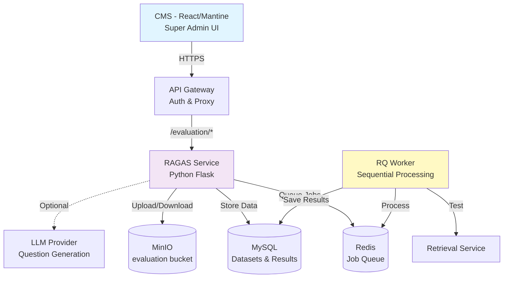

# Kế Hoạch Triển Khai Hệ Thống Đánh Giá RAGAS cho LTV Assistant

**Phiên bản Tài liệu:** 5.0
**Ngày tạo:** 2025-11-10
**Loại Tài liệu:** Product Requirements Document (PRD)
**Trạng thái:** Draft
**Ngôn ngữ:** Tiếng Việt

---

## Mục Lục

1. [Tổng Quan](#tổng-quan)
2. [Yêu Cầu Nghiệp Vụ](#yêu-cầu-nghiệp-vụ)
3. [Yêu Cầu Chức Năng](#yêu-cầu-chức-năng)
4. [Yêu Cầu Phi Chức Năng](#yêu-cầu-phi-chức-năng)
5. [Kiến Trúc Hệ Thống](#kiến-trúc-hệ-thống)
6. [Data Model](#data-model)
7. [User Flows](#user-flows)
8. [UI/UX Requirements](#uiux-requirements)
9. [Integration Points](#integration-points)
10. [Security & Access Control](#security--access-control)
11. [Phases & Milestones](#phases--milestones)
12. [Success Metrics](#success-metrics)
13. [Risks & Mitigations](#risks--mitigations)

---

## Tổng Quan

### 1.1 Mục Đích

Xây dựng hệ thống đánh giá chất lượng Retrieval System sử dụng framework RAGAS, cho phép Super Admin:
- Upload documents để tạo evaluation datasets
- Tạo và quản lý datasets với questions manually hoặc tự động bằng LLM
- Chạy evaluation tests theo cách tuần tự (sequential) để tránh overload
- Theo dõi progress real-time từng câu hỏi đang được test
- Xem kết quả evaluation chi tiết trên dashboard

### 1.2 Vấn Đề Cần Giải Quyết

**Hiện tại:**
- Không có cách đánh giá chất lượng Retrieval System
- Không biết system perform tốt hay xấu với các loại câu hỏi khác nhau
- Không có baseline để so sánh improvements
- Mỗi lần chạy evaluation phải tạo dataset mới tốn chi phí LLM

**Giải pháp:**
- Framework đánh giá chuẩn với RAGAS metrics
- Cho phép tạo datasets có thể tái sử dụng
- Hỗ trợ cả manual (tiết kiệm) và auto-generation (tiện lợi)
- Sequential testing để không làm quá tải retrieval service
- Dashboard luôn hiển thị kết quả test gần nhất

### 1.3 Đối Tượng Sử Dụng

- **Super Admin:** Duy nhất role được phép sử dụng toàn bộ evaluation system
- **System:** Retrieval service sẽ được gọi để test

### 1.4 Phạm Vi Phase 1

**Trong phạm vi:**
- ✅ Upload files vào MinIO bucket "evaluation"
- ✅ CRUD datasets (manual + auto-generated options)
- ✅ CRUD questions trong datasets
- ✅ Sequential evaluation (test từng câu một)
- ✅ Progress tracking per question
- ✅ Dashboard hiển thị last test results
- ✅ RAGAS retrieval metrics: Context Precision, Context Recall, Context Relevancy
- ✅ Super Admin only access

**Ngoài phạm vi:**
- ❌ Generation metrics (Faithfulness, Answer Relevancy)
- ❌ Scheduled/automated evaluation
- ❌ A/B testing features
- ❌ Custom metrics definitions
- ❌ Multi-user collaboration
- ❌ Public API access

---

## Yêu Cầu Nghiệp Vụ

### 2.1 Business Goals

1. **Đo lường chất lượng Retrieval:** Có cơ sở để đánh giá system perform tốt hay không
2. **Tiết kiệm chi phí:** Cho phép tạo sẵn datasets để tái sử dụng, không phải generate mỗi lần test
3. **Tránh overload system:** Test tuần tự từng câu hỏi một thay vì parallel
4. **Easy monitoring:** Dashboard luôn hiển thị kết quả test gần nhất
5. **Baseline cho improvements:** Có dữ liệu lịch sử để so sánh khi optimize system

### 2.2 Key Use Cases

**UC1: Super Admin tạo dataset manually**
- Upload files chứa documents cần test
- Tự viết questions và expected contexts
- Không tốn chi phí LLM
- Kiểm soát hoàn toàn chất lượng questions

**UC2: Super Admin tạo dataset bằng LLM (optional)**
- Upload files
- LLM tự động generate questions từ file content
- Tiết kiệm thời gian
- Có thể edit questions sau khi generate

**UC3: Super Admin chạy evaluation**
- Chọn dataset đã có
- Chọn documents/files liên quan
- Hệ thống test tuần tự từng câu một
- Xem progress real-time
- Nhận kết quả chi tiết

**UC4: Super Admin xem dashboard**
- Tự động hiển thị test gần nhất
- Xem metrics overview
- Xem chi tiết từng câu hỏi
- Export results

### 2.3 Business Constraints

- **Budget:** Tránh chi phí LLM không cần thiết → cho phép manual datasets
- **System Load:** Retrieval service không được quá tải → sequential testing
- **Security:** Chỉ super admin → role-based access control
- **Data Privacy:** Files evaluation riêng biệt với production documents → bucket "evaluation"

---

## Yêu Cầu Chức Năng

### 3.1 File Management

**FR-FILE-001: Upload Files**
- Super Admin có thể upload files (PDF, DOCX, TXT, MD)
- Max file size: 100MB
- Files lưu vào MinIO bucket "evaluation"
- Validation: file type, size
- Response: file_id, presigned URL (optional)

**FR-FILE-002: List Files**
- Hiển thị danh sách files đã upload
- Pagination support
- Filter by uploaded_by
- Show: filename, size, type, upload date

**FR-FILE-003: Delete Files**
- Xóa file khỏi MinIO và database
- Cascade delete: nếu file đang được dùng trong dataset, cảnh báo

**FR-FILE-004: Download Files**
- Generate presigned download URL
- URL expiry: 1 hour

### 3.2 Dataset Management

**FR-DS-001: Create Dataset**
- Input: name, description, source (manual/llm_generated)
- Link với uploaded files
- Source = manual: dataset rỗng, admin sẽ thêm questions sau
- Source = llm_generated: trigger auto-generation

**FR-DS-002: List Datasets**
- Hiển thị tất cả datasets
- Pagination, sorting, filtering
- Show: name, total_questions, source, created_date, created_by

**FR-DS-003: Get Dataset Details**
- Xem thông tin dataset
- List tất cả questions trong dataset
- Show linked files

**FR-DS-004: Update Dataset**
- Sửa name, description
- KHÔNG cho phép đổi source type sau khi tạo

**FR-DS-005: Delete Dataset**
- Xóa dataset và tất cả questions
- Cascade delete evaluation runs sử dụng dataset này
- Confirmation required

### 3.3 Question Management

**FR-Q-001: Add Questions (Bulk)**
- Thêm nhiều questions cùng lúc vào dataset
- Input: array of {question, expected_context, metadata}
- Auto-assign order_index cho sequential testing

**FR-Q-002: Update Question**
- Sửa question text
- Sửa expected_context
- Sửa metadata

**FR-Q-003: Delete Question**
- Xóa single question khỏi dataset
- Re-order các questions còn lại

**FR-Q-004: Reorder Questions**
- Thay đổi order_index
- Quan trọng cho sequential testing

### 3.4 LLM Generation (Optional)

**FR-GEN-001: Generate Questions from Files**
- Input: file_ids, questions_per_chunk
- LLM đọc file content và generate questions
- Output: dataset với auto-generated questions
- User có thể review và edit sau

**FR-GEN-002: Chunk Configuration**
- Configurable chunk size (min, max)
- Configurable questions per chunk
- Deduplication logic

### 3.5 Evaluation Execution

**FR-EVAL-001: Create Evaluation Job**
- Input: dataset_id, config (topK, metrics, etc.)
- Tạo async job
- Return: job_id
- Queue job vào Redis Queue

**FR-EVAL-002: Sequential Testing**
- Test TỪNG câu hỏi một (KHÔNG parallel)
- Loop: for each question in order_index
  - Update current_question_index
  - Update current_question_id
  - Call retrieval service
  - Evaluate with RAGAS
  - Save result immediately
  - Update progress
- Next question chỉ chạy sau khi question hiện tại done

**FR-EVAL-003: Progress Tracking**
- Real-time progress update
- Show: "Testing question 35/100"
- Show: current_question_id being tested
- Progress percentage: (current/total) * 100
- Update in Redis cache để CMS poll

**FR-EVAL-004: Error Handling**
- Nếu 1 question fail: log error, mark as failed, continue next
- Nếu critical error: stop job, mark as failed
- Retry logic: max 3 retries per question

**FR-EVAL-005: Results Storage**
- Mỗi question → 1 row trong evaluation_results
- Save: question, retrieved_contexts, expected_context, scores, metadata
- Save timing info: retrieval_time, evaluation_time
- Save cache hit/miss info

### 3.6 Results & Dashboard

**FR-DASH-001: Auto-Load Latest Run**
- Dashboard tự động query latest evaluation run
- Không cần user chọn run_id
- Query: SELECT * FROM evaluation_runs ORDER BY created_at DESC LIMIT 1

**FR-DASH-002: Metrics Overview**
- Show aggregate metrics:
  - Average scores (precision, recall, relevancy)
  - Min, max, std
  - Total questions, successful, failed
  - Processing time
- Visual: progress bars, badges

**FR-DASH-003: Detailed Results**
- List all questions với scores
- Pagination support
- Filter: by score range, by question text
- Sort: by score, by question order
- Show: question, contexts, expected_context, scores

**FR-DASH-004: Question Detail Modal**
- Click vào question → show detail
- Show: full question text
- Show: all retrieved contexts
- Show: expected context
- Show: RAGAS scores với explanation
- Show: metadata (timing, cache hit)

**FR-DASH-005: Export Results**
- Export to CSV
- Export to JSON
- Include all details or summary only

### 3.7 Job Management

**FR-JOB-001: Get Job Status**
- Input: job_id
- Return: status, phase, progress, current_step, error
- Poll interval: 5 seconds

**FR-JOB-002: List Jobs**
- Show job history
- Pagination, filtering by status, date
- Show: job_id, status, progress, created_date

**FR-JOB-003: Cancel Job**
- KHÔNG implement trong Phase 1 (nice to have)

---

## Yêu Cầu Phi Chức Năng

### 4.1 Performance

**NFR-PERF-001: Sequential Testing Performance**
- Test 1 question at a time
- Expected time per question: 2-5 seconds (tùy retrieval service)
- 100 questions = ~5-10 phút
- Acceptable để tránh overload

**NFR-PERF-002: File Upload**
- Support up to 100MB files
- Upload time: < 30 seconds cho 10MB file
- Presigned URL option cho large files

**NFR-PERF-003: Dashboard Load Time**
- Dashboard load latest run: < 2 seconds
- Results list (paginated): < 1 second

**NFR-PERF-004: API Response Time**
- List datasets: < 500ms
- List questions: < 1s (pagination)
- Create dataset: < 200ms

### 4.2 Scalability

**NFR-SCALE-001: Dataset Size**
- Support up to 1000 questions per dataset
- Support up to 50 datasets

**NFR-SCALE-002: File Storage**
- MinIO bucket "evaluation": up to 10GB
- ~100 files average

**NFR-SCALE-003: Concurrent Users**
- Phase 1: 1 super admin
- System designed for future multi-user

**NFR-SCALE-004: Job Queue**
- Support up to 10 pending jobs
- 1 worker process jobs sequentially

### 4.3 Reliability

**NFR-REL-001: Job Completion**
- Jobs must complete or fail, không được stuck
- Timeout: 2 hours per job
- Auto-fail nếu exceed timeout

**NFR-REL-002: Data Persistence**
- Partial results saved immediately
- Nếu job crash, results đã save không bị mất
- Resume support (nice to have, not Phase 1)

**NFR-REL-003: Error Recovery**
- Retry failed questions up to 3 times
- Log all errors với context
- Graceful degradation

### 4.4 Maintainability

**NFR-MAINT-001: Code Organization**
- Follow Python best practices
- Clear separation of concerns
- Feature Sliced Design cho frontend

**NFR-MAINT-002: Logging**
- Structured logging (JSON format)
- Log levels: debug, info, warning, error
- Include context: user_id, job_id, question_id

**NFR-MAINT-003: Configuration**
- Environment-based configuration
- No hardcoded values
- Easy to change settings

### 4.5 Usability

**NFR-USE-001: UI Responsiveness**
- CMS UI responsive với Mantine components
- Real-time progress updates (poll every 5s)
- Clear feedback messages

**NFR-USE-002: Error Messages**
- User-friendly error messages
- Actionable guidance
- No technical jargon in UI

**NFR-USE-003: Help & Documentation**
- Tooltips for complex features
- In-app help text
- README documentation

---

## Kiến Trúc Hệ Thống

### 5.1 Tổng Quan Architecture

**Microservices Pattern:**
- **ltv-ragas-evaluation:** Python Flask service độc lập
- **RQ Worker:** Background job processor
- **API Gateway:** Proxy và authentication
- **CMS:** React frontend

**Characteristics:**
- Stateless service
- Direct database access (MySQL, Redis, MinIO)
- Async job processing
- RESTful API

### 5.2 System Components



### 5.3 Technology Stack

**Backend:**
- Python 3.11+
- Flask (web framework)
- SQLAlchemy (ORM)
- Redis Queue (async jobs)
- RAGAS 0.3.8 (evaluation framework)
- MinIO client (file storage)

**Frontend:**
- React 19
- Mantine UI 8.3
- React Query (data fetching)
- React Router (routing)

**Infrastructure:**
- Docker & Docker Compose
- MySQL 8.0
- Redis 7
- MinIO (S3-compatible)

**Optional:**
- Ollama / OpenAI / Anthropic (LLM providers)

### 5.4 Data Flow

**Upload Flow:**
```
User Upload File → API Gateway → Flask → MinIO (store) + MySQL (metadata)
```

**Create Dataset Flow:**
```
User Create Dataset → API Gateway → Flask → MySQL (dataset record)
User Add Questions → API Gateway → Flask → MySQL (questions with order_index)
```

**Evaluation Flow:**
```
User Start Eval → Flask → Create Job → Redis Queue
RQ Worker → Get Job → Load Dataset → Loop Questions:
  For each question (sequential):
    - Update progress
    - Call Retrieval Service
    - RAGAS evaluate
    - Save result to MySQL
    - Update Redis cache
```

**Dashboard Flow:**
```
User Open Dashboard → Query latest run → MySQL → Return results → Display
```

---

## Data Model

### 6.1 Core Entities

**EvaluationFile:**
- file_id (PK)
- filename, original_filename
- content_type, filesize
- minio_bucket, minio_object_name
- uploaded_by_user_id
- created_at, updated_at

**EvaluationDataset:**
- dataset_id (PK)
- name, description
- source (manual | llm_generated)
- config (JSON)
- total_questions
- created_by_user_id
- created_at, updated_at

**DatasetQuestion:**
- question_id (PK)
- dataset_id (FK)
- question (TEXT)
- expected_context (TEXT)
- order_index (INT) ← Important for sequential
- metadata (JSON)
- created_at, updated_at

**EvaluationRun:**
- run_id (PK)
- dataset_id (FK)
- job_id (FK to EvaluationJob)
- status (pending | running | completed | failed)
- config (JSON)
- total_questions, successful_questions, failed_questions
- **current_question_index (INT)** ← Track current position
- **current_question_id** ← Track which question testing
- average_scores (JSON)
- statistics (JSON)
- processing_time_ms
- created_at, completed_at

**EvaluationResult:**
- result_id (PK)
- run_id (FK)
- question_id (FK)
- question (TEXT)
- retrieved_contexts (JSON array)
- expected_context (TEXT)
- context_precision (FLOAT)
- context_recall (FLOAT)
- context_relevancy (FLOAT)
- metadata (JSON: timing, cache_hit)
- created_at

**EvaluationJob:**
- job_id (PK)
- status (pending | processing | completed | failed)
- phase (validating | loading_dataset | testing_questions | calculating_stats)
- progress_percent (INT)
- **current_step (VARCHAR: "Testing question 35/100")** ← For display
- config (JSON)
- created_by_user_id
- error_message
- created_at, started_at, completed_at

### 6.2 Relationships

```
EvaluationDataset 1 ─── N DatasetQuestion
EvaluationDataset 1 ─── N EvaluationRun
EvaluationRun 1 ─── N EvaluationResult
EvaluationJob 1 ─── 1 EvaluationRun
EvaluationDataset N ─── N EvaluationFile (many-to-many)
```

### 6.3 Indexes

**Key Indexes:**
- dataset_id, question_id, run_id, job_id
- order_index (for sequential ordering)
- current_question_index (for progress tracking)
- created_at (for latest run query)
- status (for filtering)

---

## User Flows

### 7.1 Create Manual Dataset Flow

```
1. Super Admin clicks "New Dataset"
2. Fill form: name, description
3. Select source: "Manual"
4. Upload files (optional, for reference)
5. Submit → dataset created
6. Navigate to "Add Questions"
7. Bulk input questions:
   - Question text
   - Expected context
   - Metadata (optional)
8. Submit → questions saved với order_index auto-assigned
9. Done → dataset ready for evaluation
```

### 7.2 Create Auto-Generated Dataset Flow

```
1. Super Admin clicks "New Dataset"
2. Fill form: name, description
3. Select source: "LLM Generated"
4. Upload files (required)
5. Configure: questions_per_chunk
6. Submit → async job created
7. Wait for generation (poll progress)
8. Review generated questions
9. Edit/delete questions if needed
10. Done → dataset ready for evaluation
```

### 7.3 Run Evaluation Flow

```
1. Super Admin clicks "Run Evaluation"
2. Select dataset từ dropdown
3. Configure:
   - retrieval_top_k
   - metrics (default: all)
4. Submit → job created
5. Redirect to "Job Status" page
6. Poll progress every 5 seconds:
   - Show progress bar
   - Show current_step: "Testing question 35/100"
   - Show estimated time remaining
7. When completed → redirect to results
8. Or click "View Dashboard" → auto-show this run
```

### 7.4 View Results Flow

```
1. Super Admin opens "Evaluation Dashboard"
2. System auto-loads latest run
3. Display:
   - Metrics overview (cards with scores)
   - Progress summary
   - Questions list (paginated)
4. Click on a question → modal opens:
   - Full question text
   - Retrieved contexts (all 10)
   - Expected context
   - RAGAS scores
   - Metadata
5. Export button → download CSV/JSON
6. Select different run (optional) → dropdown
```

---

## UI/UX Requirements

### 8.1 Page Structure

**Pages:**
1. **Files Management** - Upload, list, delete files
2. **Datasets** - CRUD datasets
3. **Questions** - View and edit questions in dataset
4. **Evaluation Dashboard** - Main page, auto-show last test
5. **Job History** - List all evaluation jobs
6. **Run Evaluation** - Form to start new evaluation

### 8.2 Files Management Page

**Layout:**
```
┌─ Files Management ────────────────────────────────────┐
│  [+ Upload Files]                      [Filter ▼]      │
│                                                         │
│  ┌─ Uploaded Files ─────────────────────────────────┐ │
│  │ ┌──────────┬────────┬──────────┬──────┬────────┐ │ │
│  │ │ Filename │ Type   │ Size     │ Date │ Actions│ │ │
│  │ ├──────────┼────────┼──────────┼──────┼────────┤ │ │
│  │ │ doc1.pdf │ PDF    │ 2.5 MB   │ ...  │ 👁️ 🗑️  │ │ │
│  │ │ doc2.txt │ TXT    │ 150 KB   │ ...  │ 👁️ 🗑️  │ │ │
│  │ └──────────┴────────┴──────────┴──────┴────────┘ │ │
│  └──────────────────────────────────────────────────┘ │
└───────────────────────────────────────────────────────┘
```

**Features:**
- Dropzone for drag-and-drop upload
- File type validation
- Progress bar during upload
- Preview file metadata
- Delete confirmation

### 8.3 Datasets Page

**Layout:**
```
┌─ Datasets ────────────────────────────────────────────┐
│  [+ New Dataset]                   [Filter ▼]          │
│                                                         │
│  ┌─ Dataset List ───────────────────────────────────┐ │
│  │ ┌──────────┬─────────┬──────────┬──────────────┐ │ │
│  │ │ Name     │ Source  │ Questions│ Actions      │ │ │
│  │ ├──────────┼─────────┼──────────┼──────────────┤ │ │
│  │ │ Test Set │ Manual  │ 50       │ 👁️ ✏️ ▶️ 🗑️ │ │ │
│  │ │ Auto Gen │ LLM     │ 120      │ 👁️ ✏️ ▶️ 🗑️ │ │ │
│  │ └──────────┴─────────┴──────────┴──────────────┘ │ │
│  └──────────────────────────────────────────────────┘ │
└───────────────────────────────────────────────────────┘
```

**Actions:**
- 👁️ View: Xem questions trong dataset
- ✏️ Edit: Sửa name, description
- ▶️ Run: Start evaluation với dataset này
- 🗑️ Delete: Xóa dataset

### 8.4 Evaluation Dashboard (Main Focus)

**Layout - Auto-Show Last Test:**
```
┌─ Evaluation Dashboard ────────────────────────────────┐
│                                                         │
│  🏆 Latest Evaluation Results                          │
│  Run ID: abc-123 | Dataset: Test Set | Date: 10/11    │
│                                                         │
│  ┌─ Metrics Overview ──────────────────────────────┐  │
│  │  📦 Total: 100    ✅ Success: 95    ❌ Failed: 5 │  │
│  │  ⏱️ Time: 8m 32s                                 │  │
│  │                                                   │  │
│  │  Context Precision:   ████████████████░░  85.2%  │  │
│  │  Context Recall:      ██████████████░░░░  78.4%  │  │
│  │  Context Relevancy:   ██████████████████  92.1%  │  │
│  │                                                   │  │
│  │  Overall Score: 85.2% 🟢                         │  │
│  └──────────────────────────────────────────────────┘  │
│                                                         │
│  [📊 View All Runs] [💾 Export CSV] [📄 Export JSON]  │
│                                                         │
│  ┌─ Detailed Results ──────────────────────────────┐  │
│  │  🔍 [Search questions...]                        │  │
│  │                                                   │  │
│  │  ┌────────────────────────┬─────┬──────┬──────┐ │  │
│  │  │ Question               │ Prec│Recall│Relev │ │  │
│  │  ├────────────────────────┼─────┼──────┼──────┤ │  │
│  │  │ What is JWT auth?      │ 92% │ 85%  │ 95%  │ │  │
│  │  │ How does OAuth work?   │ 78% │ 72%  │ 88%  │ │  │
│  │  │ ...                    │ ... │ ...  │ ...  │ │  │
│  │  └────────────────────────┴─────┴──────┴──────┘ │  │
│  │                                                   │  │
│  │  [◀ Previous]  Page 1 of 10  [Next ▶]           │  │
│  └──────────────────────────────────────────────────┘  │
└───────────────────────────────────────────────────────┘
```

**Key Features:**
- Auto-load latest run (không cần chọn)
- Metrics cards với progress bars
- Color-coded scores: 🟢 >80%, 🟡 60-80%, 🔴 <60%
- Click question → modal chi tiết
- Filter và search trong results
- Export functionality

### 8.5 Run Evaluation Page

**Layout:**
```
┌─ Run Evaluation ──────────────────────────────────────┐
│                                                         │
│  Select Dataset:  [Choose dataset ▼]                   │
│  → Test Set (50 questions)                             │
│                                                         │
│  Configuration:                                         │
│  Retrieval Top K:     [10        ]                     │
│  Metrics:             [✓ All Metrics]                  │
│                                                         │
│  [▶️ Start Evaluation]                [Cancel]         │
│                                                         │
└───────────────────────────────────────────────────────┘
```

**After Start:**
```
┌─ Evaluation Progress ─────────────────────────────────┐
│                                                         │
│  Job ID: xyz-789                                        │
│  Status: ⏳ Processing                                 │
│                                                         │
│  Phase: Testing Questions (65%)                        │
│  [████████████████████████░░░░░░░░] 65%               │
│                                                         │
│  Current Step: Testing question 65/100                 │
│  Question: "What is token refresh mechanism?"          │
│                                                         │
│  Estimated Time Remaining: ~3 minutes                  │
│                                                         │
│  [🔄 Refresh Status (auto: 5s)]                        │
└───────────────────────────────────────────────────────┘
```

### 8.6 UI Components

**Reusable Components:**
- FileUploader (Dropzone)
- DatasetCard
- QuestionList
- MetricsCard
- ProgressBar
- ResultsTable
- QuestionDetailModal
- StatusBadge

**Design System:**
- Mantine UI components
- Color scheme: Blue (primary), Green (success), Red (error), Yellow (warning)
- Typography: System font stack
- Spacing: 8px grid
- Responsive: Mobile-friendly

---

## Integration Points

### 9.1 API Gateway Integration

**Path Routing:**
- `/evaluation/*` → proxy to ltv-ragas-evaluation:50059
- Gateway handles authentication
- Gateway forwards user headers: X-User-Id, X-User-Email, X-User-Role

**Role Check:**
- Gateway checks if X-User-Role === "super_admin"
- If not, return 403 Forbidden
- If yes, forward request to evaluation service

**CORS:**
- Allow origins: CMS domain
- Allow methods: GET, POST, PUT, DELETE
- Allow headers: Content-Type, Authorization

### 9.2 Retrieval Service Integration

**Endpoint Called:**
- POST /query

**Request:**
```json
{
  "query": "What is JWT authentication?",
  "topK": 10,
  "mode": "retrieval_only",
  "useCache": false
}
```

**Response:**
```json
{
  "contexts": [
    {"content": "...", "score": 0.95, "source": "..."},
    ...
  ],
  "metrics": {
    "totalDuration": 234,
    "cacheHit": false
  }
}
```

**Error Handling:**
- Timeout: 60 seconds
- Retry: 3 times with exponential backoff
- On failure: log error, mark question as failed, continue next

### 9.3 MinIO Integration

**Bucket:** evaluation

**Operations:**
- PUT: Upload file
- GET: Download file
- DELETE: Remove file
- Presigned URLs: For client-side upload/download

**Security:**
- Private bucket
- Only service có access key
- Presigned URLs có expiry (1 hour)

### 9.4 Database Integration

**MySQL:**
- Direct connection from service
- Connection pooling (10-20 connections)
- Transactions cho atomic operations
- Migrations với Alembic

**Redis:**
- Job queue (RQ)
- Cache cho job status
- Cache cho latest run ID
- TTL: 7 days for job status, no expiry for latest run

---

## Security & Access Control

### 10.1 Authentication

**Flow:**
1. User login qua Auth Service
2. Receive JWT token
3. CMS sends token trong Authorization header
4. API Gateway validates token với Auth Service
5. If valid + role = super_admin → forward to Evaluation Service
6. Evaluation Service trusts Gateway headers

**Headers:**
- X-Gateway-Auth: "verified"
- X-User-Id: "user-uuid"
- X-User-Email: "admin@example.com"
- X-User-Role: "super_admin"

### 10.2 Authorization

**Role-Based Access:**
- Only "super_admin" role can access ALL evaluation endpoints
- Other roles → 403 Forbidden
- Check at API Gateway level
- Double-check at service level (defense in depth)

**Endpoint Protection:**
- ALL /evaluation/* endpoints require super_admin
- No public endpoints
- No API key access (Phase 1)

### 10.3 Data Security

**Files:**
- Encrypted at rest (MinIO encryption)
- Private bucket
- Presigned URLs với expiry
- No direct public access

**Database:**
- Encrypted connections (TLS)
- Strong passwords
- Least privilege principle
- Regular backups

**Secrets:**
- Environment variables
- No hardcoded credentials
- Docker secrets (production)

### 10.4 API Security

**Rate Limiting:**
- Phase 1: Not implemented
- Future: 100 requests/minute per user

**Input Validation:**
- File type whitelist
- File size limits
- SQL injection prevention (ORM)
- XSS prevention (React auto-escape)

**CORS:**
- Strict origin control
- No wildcard (*)

---

## Phases & Milestones

### 11.1 Phase 1: Core Features (6-8 weeks)

**Week 1-2: Foundation**
- [ ] Setup project structure
- [ ] Database schema
- [ ] MinIO bucket setup
- [ ] Flask app skeleton
- [ ] API Gateway proxy
- [ ] Role-based middleware

**Week 3-4: File & Dataset Management**
- [ ] File upload API
- [ ] File list/delete API
- [ ] Dataset CRUD API
- [ ] Question CRUD API
- [ ] CMS: Files page
- [ ] CMS: Datasets page

**Week 5-6: Evaluation Engine**
- [ ] RAGAS evaluator setup
- [ ] Sequential job processing
- [ ] Progress tracking
- [ ] Results storage
- [ ] RQ worker
- [ ] Retrieval client

**Week 7-8: Dashboard & Polish**
- [ ] Dashboard với auto-load latest
- [ ] Results display
- [ ] Question detail modal
- [ ] Export functionality
- [ ] Testing
- [ ] Bug fixes

**Deliverables:**
- Working evaluation system
- Super admin can upload files
- Super admin can create manual datasets
- Super admin can run sequential evaluations
- Dashboard shows last test results

### 11.2 Phase 2: LLM Generation (Optional, 2-3 weeks)

**If Needed:**
- [ ] LLM integration (Ollama/OpenAI)
- [ ] Prompts for question generation
- [ ] File text extraction (PDF, DOCX)
- [ ] Auto-generation workflow
- [ ] Review/edit UI

### 11.3 Phase 3: Enhancements (Future)

**Not in Current Scope:**
- Multi-user support
- Scheduled evaluations
- A/B testing
- Custom metrics
- Advanced analytics
- Generation metrics

---

## Success Metrics

### 12.1 Technical Metrics

**System Performance:**
- File upload success rate: >99%
- Evaluation completion rate: >95%
- Average evaluation time: <10 minutes for 100 questions
- Dashboard load time: <2 seconds
- API response time: <500ms (p95)

**Reliability:**
- Service uptime: >99%
- Job success rate: >95%
- Data loss: 0%

### 12.2 Business Metrics

**Usage:**
- Number of datasets created: Track monthly
- Number of evaluations run: Track monthly
- Average questions per dataset: Target 50-100
- Reuse rate: % of evaluations using existing datasets

**Value:**
- Time saved: Manual evaluation vs automated
- Cost saved: Reusing datasets vs generating new
- Quality improvement: Track retrieval scores over time

### 12.3 User Satisfaction

**Qualitative:**
- Super admin feedback: Survey
- Feature requests: Backlog
- Bug reports: Track và resolve

**Quantitative:**
- Time to create dataset: <10 minutes
- Time to run evaluation: <15 minutes for 100 questions
- Time to view results: <1 minute

---

## Risks & Mitigations

### 13.1 Technical Risks

**Risk 1: Sequential Testing Too Slow**
- Impact: HIGH
- Probability: MEDIUM
- Mitigation:
  - Optimize retrieval service
  - Cache frequently tested questions
  - Parallel future consideration với rate limiting
  - Progress tracking để user không frustrated

**Risk 2: MinIO Storage Full**
- Impact: MEDIUM
- Probability: LOW
- Mitigation:
  - Monitor storage usage
  - Implement file size limits
  - Cleanup old/unused files
  - Lifecycle policies

**Risk 3: Job Queue Bottleneck**
- Impact: MEDIUM
- Probability: LOW
- Mitigation:
  - Single super admin (low concurrency)
  - Queue monitoring
  - Job timeout protection
  - Scale worker if needed

**Risk 4: RAGAS Evaluation Errors**
- Impact: HIGH
- Probability: MEDIUM
- Mitigation:
  - Comprehensive error handling
  - Retry logic
  - Fallback metrics
  - Save partial results

### 13.2 Business Risks

**Risk 1: Low Adoption**
- Impact: HIGH
- Probability: LOW
- Mitigation:
  - Clear value proposition
  - Easy onboarding
  - Good documentation
  - Training sessions

**Risk 2: High LLM Costs (if using auto-generation)**
- Impact: MEDIUM
- Probability: MEDIUM
- Mitigation:
  - Make auto-generation optional
  - Encourage manual datasets
  - Use local LLM (Ollama)
  - Monitor usage

**Risk 3: Retrieval Service Overload**
- Impact: HIGH
- Probability: MEDIUM
- Mitigation:
  - Sequential testing (primary mitigation)
  - Run evaluations during low-traffic hours
  - Rate limiting
  - Dedicated evaluation endpoint

### 13.3 Security Risks

**Risk 1: Unauthorized Access**
- Impact: HIGH
- Probability: LOW
- Mitigation:
  - Role-based access control
  - API Gateway authentication
  - Audit logging
  - Regular security reviews

**Risk 2: File Upload Abuse**
- Impact: MEDIUM
- Probability: LOW
- Mitigation:
  - File type whitelist
  - Size limits
  - Virus scanning (future)
  - Super admin only access

---

## Appendix

### A. Glossary

- **RAGAS:** Retrieval-Augmented Generation Assessment framework
- **Context Precision:** Tỷ lệ contexts relevant trong tổng số contexts retrieved
- **Context Recall:** Tỷ lệ ground truth được cover bởi retrieved contexts
- **Context Relevancy:** Mức độ contexts liên quan đến query
- **Sequential Testing:** Test từng item một, không parallel
- **Super Admin:** Role duy nhất được access evaluation system
- **Dataset:** Tập hợp questions để đánh giá
- **Evaluation Run:** Một lần chạy evaluation với một dataset

### B. References

- RAGAS Documentation: https://docs.ragas.io/
- Mantine UI: https://mantine.dev/
- Flask Documentation: https://flask.palletsprojects.com/
- MinIO Python SDK: https://min.io/docs/minio/linux/developers/python/minio-py.html

### C. Contact & Support

- Product Owner: [Name]
- Tech Lead: [Name]
- Questions: [Email/Slack]

---

**END OF DOCUMENT**

**Next Steps:**
1. Review và approval từ stakeholders
2. Technical design document (nếu cần chi tiết implementation)
3. Story breakdown cho development
4. Sprint planning

