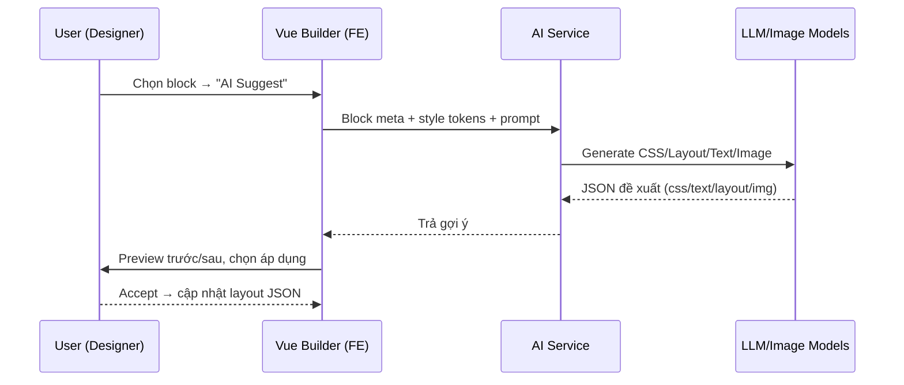
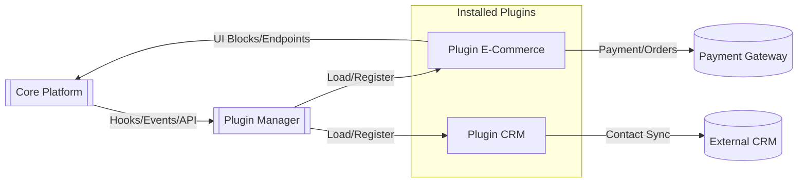
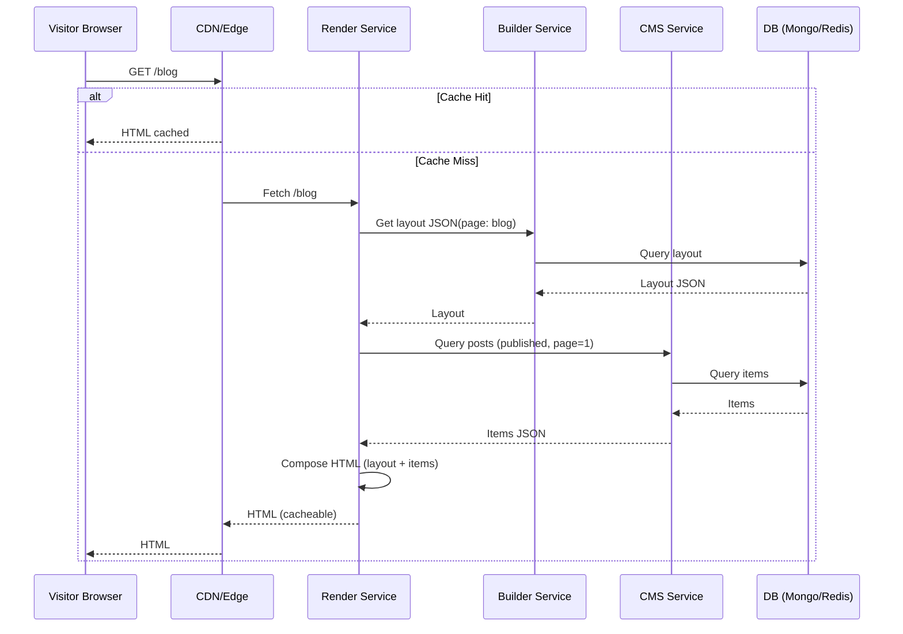
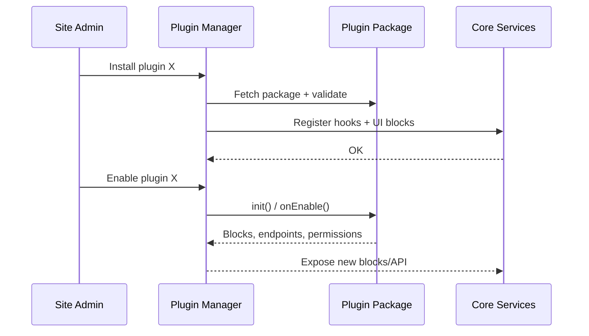

# Nền tảng Website Builder hiện đại tích hợp AI — Bản thiết kế chi tiết

> Mục tiêu: Xây dựng một **platform SaaS** tương tự WordPress nhưng hiện đại hơn: website builder kéo–thả (drag & drop) cho end-user, **AI Design Assistant**, **CMS động** gắn chặt với builder, **hệ plugin mở rộng** (eCommerce, thanh toán, form, SEO…), **cộng tác thời gian thực**, **multi-tenant**, **free trial 7 ngày** và **subscription** theo tháng/năm.

---

## 0) Tóm tắt nhanh (Executive Summary)

- **Kiến trúc**: Microservices định tuyến qua API Gateway. Dữ liệu phân tách theo tenant (multi-tenant).
- **Frontend builder**: **Vue 3 + Vite** (SPA), **Pinia** (state), **Vue Router**, kéo–thả với **Gridstack + Vue Draggable + Moveable**, rich text **Tiptap (Vue)**, realtime **Yjs + y-websocket**.
- **Backend**: **Node.js + TypeScript** với **NestJS** (REST + GraphQL + gRPC).
- **Dữ liệu**: **PostgreSQL** (user/plan/billing), **MongoDB** (layout JSON, CMS dynamic), **Redis** (cache/session), **MeiliSearch/Elasticsearch** (search).
- **AI/ML**: AI Service (Python/FastAPI hoặc Node) tích hợp LLM (GPT-4 class) cho sinh nội dung/CSS/layout gợi ý; image gen (Stable Diffusion/DALL·E).
- **DevOps**: Docker, **Kubernetes**, IaC (**Terraform**), CI/CD (GitHub Actions), Observability (Prometheus + Grafana, ELK, OpenTelemetry), CDN (CloudFront/Cloudflare), Object Storage (S3/GCS).
- **Bảo mật**: JWT/OAuth2, RBAC theo plan, sandbox plugin, CSP/XSS/CSRF, rate limit, WAF, backup/DR.
- **Kinh doanh**: Free trial 7 ngày ⇒ hạ quyền về Free nếu không trả phí; gói Pro/Business mở tính năng (AI, collab, plugin nâng cao, băng thông, chỗ lưu, domain tùy chỉnh…).

---

## 1) Kiến trúc tổng thể

### 1.1 Lựa chọn: Microservices hay Modular Monolith?

- **Chọn Microservices** cho: khả năng mở rộng độc lập theo tải (builder, render, CMS, AI), tự do công nghệ (Python cho AI, Node cho web), độ tin cậy (dịch vụ lỗi không kéo sập toàn hệ thống), triển khai độc lập.
- **Lưu ý**: Độ phức tạp DevOps, giám sát/log tracing phân tán, nhất quán dữ liệu theo kiểu **eventual consistency** giữa dịch vụ.

### 1.2 Các service chính & mối quan hệ

- **API Gateway**: điểm vào duy nhất (AuthN/Z, rate limit, routing, metrics).
- **Auth & User Service**: đăng ký/đăng nhập, SSO/OAuth, quản lý tenant/role/plan, free trial.
- **Billing Service**: subscription (Stripe/PayPal), hoá đơn, webhook.
- **Builder Service**: lưu/đọc **layout JSON** trang, thư viện block, publish pipeline.
- **CMS Service**: collection schema động, CRUD, GraphQL/REST, localization, draft/publish.
- **Plugin Service**: Plugin Manager, hook lifecycle, sandbox, marketplace.
- **AI Service**: LLM & image gen, prompt templates, caching, moderation.
- **Render/Delivery Service**: SSR/SSG, ghép **layout + data**, HTML cache, edge delivery.
- **Media Service**: upload, optimize, transform (WebP/AVIF), CDN.
- **Search Service**: indexing (Meili/ES) cho CMS.
- **Collaboration Service**: WebSocket + CRDT (Yjs) cho realtime editing.

#### Sơ đồ kiến trúc tổng thể

```mermaid
flowchart LR
    subgraph Client[Client-Side]
        direction TB
        EditorApp[Vue 3 SPA Builder\n(Vite, Pinia, Router)]
        PublicSite[Visitor-Facing Site]
    end

    subgraph Edge[Edge/CDN]
        CDN[(CDN/Cache)]
    end

    subgraph Backend[Microservices]
        APIGW[[API Gateway]]
        Auth[[Auth & User]]
        Billing[[Billing/Subscription]]
        Builder[[Builder Service]]
        CMS[[CMS Service (REST/GraphQL)]]
        Plugin[[Plugin Manager]]
        AI[[AI Service]]
        Render[[Render/Delivery]]
        Media[[Media/Image Service]]
        Search[[Search/Indexing]]
        Collab[[Collaboration (WebSocket)]]
    end

    subgraph Data[Data Layer]
        PG[(PostgreSQL)]
        MDB[(MongoDB)]
        RDS[(Redis Cache)]
        OBJ[(Object Storage S3)]
        IDX[(Meili/Elastic)]
    end

    EditorApp -->|AuthN/Z| APIGW
    EditorApp -->|Layout/Data| APIGW
    PublicSite --> CDN
    CDN --> Render

    APIGW --> Auth
    APIGW --> Billing
    APIGW --> Builder
    APIGW --> CMS
    APIGW --> Plugin
    APIGW --> AI
    APIGW --> Render
    APIGW --> Media
    APIGW --> Search
    EditorApp --- Collab

    Auth --> PG
    Billing --> PG
    Builder --> MDB
    CMS --> MDB
    Plugin --> MDB
    Media --> OBJ
    Search --> IDX
    Render --> RDS
    CMS --> RDS
    Builder --> RDS
```

---

## 2) Lựa chọn công nghệ chi tiết

### 2.1 Frontend (Website Builder UI)

- **Stack**: **Vue 3** (Composition API) + **Vite** (fast dev/build) + **TypeScript**.
- **State**: **Pinia** (undo/redo qua history store, snapshot), optional Vuex 4 nếu cần plugin ecosystem cũ.
- **Router**: **Vue Router** (admin vs editor vs public preview).
- **Kéo–thả & layout**:
  - **Gridstack**: grid responsive 12 cột, resize/drag snap, lưu toạ độ block.
  - **Vue Draggable (SortableJS)**: sắp xếp khối trong danh sách/section.
  - **Moveable** (daybrush) bản Vue: resize/rotate/drag tinh chỉnh block.
- **Rich Text & Editor**: **Tiptap (Vue)** + extensions (mention, link, image), hỗ trợ collab với Yjs.
- **Form**: Vee-Validate/Vuelidate, UI form builder block.
- **UI Kit**: Naive UI hoặc Element Plus (admin), TailwindCSS (builder canvas nhanh gọn, token theo theme).
- **Realtime**: **Yjs** client + **y-websocket**; presence (cursor, selection) qua Awareness API.
- **i18n**: **vue-i18n** cho admin/builder; content i18n handled by CMS schema.
- **PWA & Workers**: Service Worker cho cache offline nhẹ; Web Worker cho tác vụ tính layout nặng.

### 2.2 Backend & API

- **Runtime**: **Node.js + TypeScript**.
- **Framework**: **NestJS** (REST, GraphQL, WebSocket Gateway, Microservice transport gRPC/Redis/NATS).
- **API styles**: Public REST; CMS **GraphQL** (flex query); Internal **gRPC** giảm latency.
- **Data**:
  - **PostgreSQL**: user, tenant, plan, billing, permissions, audit.
  - **MongoDB**: layout JSON, CMS collections/items, plugin metadata.
  - **Redis**: cache, session, short-lived token, pub/sub collab.
  - **Object Storage**: S3/GCS cho media; signed URL upload, image processing pipeline.
  - **Search**: MeiliSearch (nhẹ, nhanh) hoặc Elasticsearch (mạnh, clusterable).
- **Gateway**: NGINX/Envoy/Kong; JWT verification, rate-limit, circuit breaker.
- **Queues**: SQS/RabbitMQ/Kafka cho jobs (email, indexing, image transform, webhooks).

### 2.3 AI/ML

- **AI Service**: Python (FastAPI) hoặc Node (Nest) tuỳ đội ngũ.
- **Nhiệm vụ**: sinh nội dung (copy, heading), gợi ý CSS/theme, gợi ý layout/block, tạo ảnh.
- **Model**: LLM lớp **GPT-4** (hoặc tương đương), image gen (Stable Diffusion/DALL·E). Prompt template theo task, output **JSON có cấu trúc** (cssRules, blockTree, textVariants…).
- **Moderation**: kiểm duyệt nội dung AI sinh; lọc từ nhạy cảm.
- **Caching**: Redis cache theo (task+prompt+siteStyle) để giảm chi phí/độ trễ.

### 2.4 DevOps & Hạ tầng

- **Containers**: Docker cho từng service; multi-stage build.
- **Orchestration**: **Kubernetes** (EKS/GKE/AKS); HPA (CPU/RAM/latency), PodDisruptionBudget, PodSecurity.
- **CI/CD**: GitHub Actions/GitLab CI → build test scan (Trivy) → push image → deploy (ArgoCD/Helm). Canary/Blue-Green.
- **IaC**: Terraform/Pulumi khai báo EKS, RDS, VPC, S3, CloudFront, IAM.
- **Observability**: Prometheus + Grafana (metrics), Loki/ELK (logs), OpenTelemetry + Jaeger (tracing).
- **CDN**: CloudFront/Cloudflare, edge caching HTML/asset, purge on publish.

---

## 3) Thiết kế các thành phần cốt lõi

### 3.1 Website Builder Engine

**Frontend UI (Vue 3 SPA)**

- Canvas kéo–thả: grid responsive, snap lines, rulers, guides.
- Property Panel: font, màu, spacing, radius, shadow, responsive per breakpoint.
- Layer/Tree view: cấu trúc block lồng nhau; breadcrumbs.
- Template/Theme: chọn template; theme tokens (color, spacing, typography) áp dụng toàn site.
- Undo/Redo, lịch sử; snapshot trước/after; preview live.
- Publish: ấn nút → trigger pipeline build/purge CDN.

**Mô hình dữ liệu (layout JSON)**

```json
{
  "id": "page_home",
  "name": "Home",
  "route": "/",
  "theme": { "primary": "#3B82F6", "font": "Inter" },
  "blocks": [
    {
      "type": "hero",
      "props": { "title": "Welcome", "subtitle": "We build fast" },
      "style": { "bg": "linear-gradient(...)" },
      "children": []
    },
    {
      "type": "cms-list",
      "props": {
        "collection": "blog_posts",
        "limit": 6,
        "itemTemplateId": "tpl_blog_card"
      },
      "children": []
    }
  ]
}
```

**Backend Builder Service**

- API: save/load page, list blocks, list templates, publish, diff/versions.
- Publish pipeline: validate layout → pre-render partials → write cache → purge CDN.

**Realtime Collaboration**

- Yjs document per page; y-websocket server (Collaboration Service). Presence (cursor, selection, user color). Conflict-free merges.

**Tích hợp CMS trong Builder**

- Block **cms-list**/**cms-item**: chọn collection + mapping field → render template.
- Dynamic Pages: template detail tạo route `/blog/:slug` tự động.

### 3.2 AI Design Assistant

- Tác vụ: (1) gợi ý bố cục/section, (2) sinh copy (đa ngôn ngữ), (3) gợi ý theme/CSS, (4) tạo ảnh minh hoạ.
- Prompt context: site style tokens, current blocks, industry keywords, tone of voice.
- Output JSON: `{ cssRules: string, suggestions: BlockTree[], texts: {variantA,B}, images: [url] }`.

**Workflow AI**



### 3.3 CMS Core (Headless-first, dynamic schema)

- Collection Builder: định nghĩa field (text, number, media, reference, richtext, enum, i18n,…).
- CRUD: REST `/api/cms/{collection}`; GraphQL flexible.
- Draft/Publish, scheduling, versioning, audit.
- Relations/reference, populate; computed fields (resolver).
- Localization: field-level i18n; fallback.
- Media: upload → optimize → transform URL; signed URL.
- Performance: indices, pagination, cache (Redis), search index.
- Security: tenant_id filter mọi query; RBAC (owner/admin/editor/viewer).

### 3.4 Plugin System Architecture

- **Plugin Manager**: cài/enable/disable; registry/marketplace; versioning & migrations; permissions manifest.
- **Hook points**: lifecycle (init, enable, disable), CMS hooks (before/after save), Builder hooks (block registry), Render hooks (pre/post render), Webhooks.
- **Frontend blocks**: plugin đăng ký block mới (metadata + editor schema + renderer). Dynamic import bundle.
- **Sandbox**: run in isolated process/container; limited API surface; resource quotas.

**Sơ đồ plugin**



### 3.5 Real-time Collaboration System

- **CRDT**: Yjs documents cho page/layout, cho phép offline edits & auto-merge.
- **Transport**: y-websocket; Redis Pub/Sub làm adapter multi-node.
- **Presence**: Awareness (cursor, selection, username, color).
- **ACL**: chỉ team member của tenant được join room; role-based edit/view.
- **Scale**: sharding theo page/site; HPA theo số connection; sticky sessions hoặc stateless với Redis adapter.

---

## 4) Data flow & AI/Plugin workflows (Mermaid)

### 4.1 Luồng hiển thị trang public



### 4.2 Luồng AI integration (đã ở 3.2) — xem lại sequence mermaid phía trên

### 4.3 Vòng đời plugin (lifecycle simplifed)



---

## 5) Phân tích kỹ thuật

### 5.1 Lý do lựa chọn

- **Vue 3 + Vite**: hiệu năng dev/build nhanh, Composition API phù hợp UI phức tạp (builder canvas), hệ sinh thái phong phú (Pinia, Tiptap, Gridstack…).
- **NestJS**: kiến trúc module hoá, hỗ trợ REST/GraphQL/WebSocket/gRPC, dễ mở microservices.
- **Polyglot storage**: Postgres (ACID, billing), Mongo (schema linh hoạt cho layout/CMS), Redis (tốc độ/cache), Search engine (full-text, typo tolerance).
- **CRDT (Yjs)**: đảm bảo realtime hợp nhất không xung đột, hoạt động tốt với Tiptap + Vue.
- **Edge/CDN + SSR/SSG**: tốc độ tải nhanh, SEO tốt, scale rẻ.

### 5.2 Ưu/nhược điểm kiến trúc

- **Ưu**: scale độc lập, độ tin cậy, triển khai nhanh từng phần, mở rộng tính năng qua plugin, phù hợp SaaS multi-tenant.
- **Nhược**: DevOps phức tạp hơn, quan sát phân tán, nhất quán dữ liệu bằng event; yêu cầu kỷ luật về contract API.

### 5.3 Chiến lược scaling & tối ưu hiệu năng

- Autoscale theo tải; tách cụm Render vs Builder; cache HTML/JSON (Redis, CDN); index DB hợp lý; queue background jobs; pre-render/SSG cho trang ít đổi; lazy-load blocks; code-splitting.

### 5.4 Security considerations

- **Tenant isolation**: tenant_id bắt buộc trong mọi query; row-level security (RLS) ở Postgres (nếu áp dụng); schema per tenant cho enterprise.
- **AuthZ**: RBAC theo role + plan; feature flags theo plan.
- **Plugin sandbox**: isolate process/container, permission manifest, rate limit, secrets scoped.
- **Web security**: CSP, XSS sanitize (DOMPurify cho HTML user), CSRF, rate limit/WAF, HTTPS, JWT rotation, audit log, SIEM.
- **Compliance**: PCI (uỷ quyền cổng thanh toán), GDPR (export/delete data), backups & DR (cross-region).

---

## 6) Subscription & gói sản phẩm

### 6.1 Luồng free trial 7 ngày

1. User đăng ký ⇒ tạo tenant + plan=trial, set `trial_ends_at=now+7d`.
2. Middleware kiểm tra: nếu `now > trial_ends_at` và chưa thanh toán ⇒ chuyển `plan=free` (giới hạn tính năng), thông báo nâng cấp.
3. Khi thanh toán thành công (webhook Stripe) ⇒ set plan theo gói, mở khoá tính năng ngay.

### 6.2 Ma trận tính năng minh hoạ

| Tính năng              | Free Trial (7d) |      Free |                Pro |           Business |
| ---------------------- | --------------: | --------: | -----------------: | -----------------: |
| AI Design Assistant    |            Full |         ✕ | ✓ (giới hạn token) |                 ✓✓ |
| Realtime Collaboration |               ✓ |         ✕ |                  ✓ |                 ✓✓ |
| Plugin marketplace     |          Cơ bản |    Cơ bản |           Nâng cao | Nâng cao + Private |
| Domain tùy chỉnh       |               ✓ |         ✕ |                  ✓ |                  ✓ |
| Băng thông/CDN         |             Cao |      Thấp |                Cao |            Rất cao |
| Storage media          |            5 GB |      1 GB |              50 GB |             200 GB |
| Hỗ trợ                 |       Community | Community |           Standard |       Priority/SLA |

> Gating qua **feature flags** + middleware tại API Gateway & dịch vụ đích.

---

## 7) API thiết kế (ví dụ rút gọn)

- **Auth**: `POST /auth/signup`, `POST /auth/login`, `GET /me` (JWT), `POST /billing/subscribe`, webhook `/billing/stripe`.
- **Builder**: `GET/PUT /builder/pages/:id`, `POST /builder/pages`, `POST /builder/publish/:id`, `GET /builder/blocks`.
- **CMS (REST)**: `GET/POST /cms/:collection`, `GET /cms/:collection/:id`, `PUT/PATCH/DELETE ...`
- **CMS (GraphQL)**: `POST /cms/graphql` (schema dynamic per tenant).
- **Plugin**: `POST /plugins/install`, `POST /plugins/:id/enable`, `DELETE /plugins/:id`.
- **Media**: `POST /media/upload` (signed URL), `GET /media/:id`.
- **Render**: `GET /:route` (internal), purge: `POST /render/purge`.

---

## 8) Kế hoạch triển khai (90 ngày)

**P0 (Tuần 1–4)**

- Skeleton hạ tầng (repo, CI/CD, IaC cơ bản, EKS dev), Auth/User, Billing webhook stub.
- Builder Vue 3 (canvas + grid + block cơ bản + save/load), CMS minimal (collection builder + CRUD), Render SSR/SSG prototype, Media upload.

**P1 (Tuần 5–8)**

- Realtime collab (Yjs) cho text + layout, template/theme, search index, cache Redis, CDN tích hợp.
- AI v1: sinh copy, gợi ý CSS; moderation; cache.
- Plugin Manager v1: hook tối thiểu, block registry, marketplace prototype.

**P2 (Tuần 9–12)**

- Harden bảo mật (CSP, sanitize), observability full, autoscale, backup/DR.
- AI v2: gợi ý section/layout, image gen integration, A/B test nội bộ.
- E-commerce plugin v1: product, cart, checkout (Stripe), order webhooks.
- Beta private + pricing/limits + migration tooling.

---

## 9) Khuyến nghị hành động (Actionable)

- Chốt **stack**: Vue 3 + Vite + Pinia + Tiptap; NestJS; Postgres + Mongo + Redis; S3 + CloudFront.
- Bắt đầu với **modular microservices** (Auth, CMS, Builder, Render, Media); defer Plugin/AI nâng cao sang P1/P2 nhưng thiết kế **hook** ngay từ đầu.
- Áp dụng **tenant isolation** chuẩn hóa (tenant_id mandatory), feature flags theo plan.
- Thiết lập **CI/CD + IaC** ngay từ sprint 1; logging/metrics/tracing tối thiểu.
- Ưu tiên **UX Builder** (grid, property panel, template/theme) + **CMS GraphQL** trước; song song dựng **Render** và **CDN** để đạt tốc độ public site.

---

> Tài liệu này có thể chỉnh sửa, mở rộng thêm các phụ lục (schema chi tiết, OpenAPI/GraphQL SDL, migration plan, threat model, test plan) tùy theo tiến độ và phạm vi sprint.
