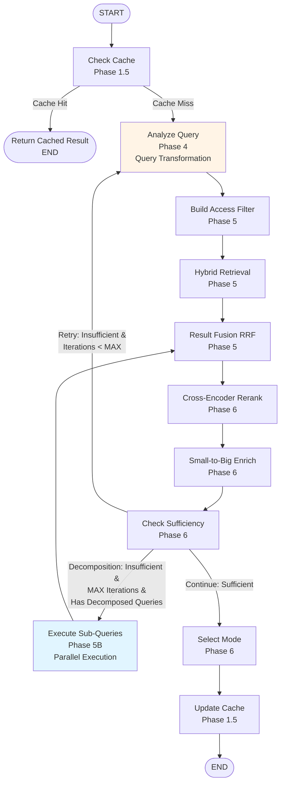
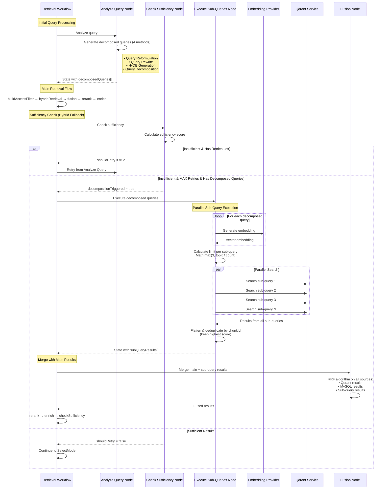
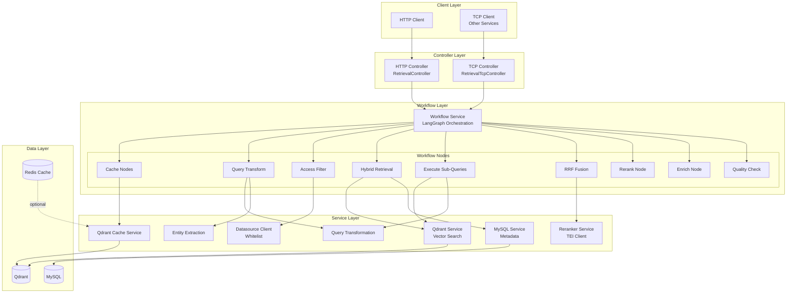
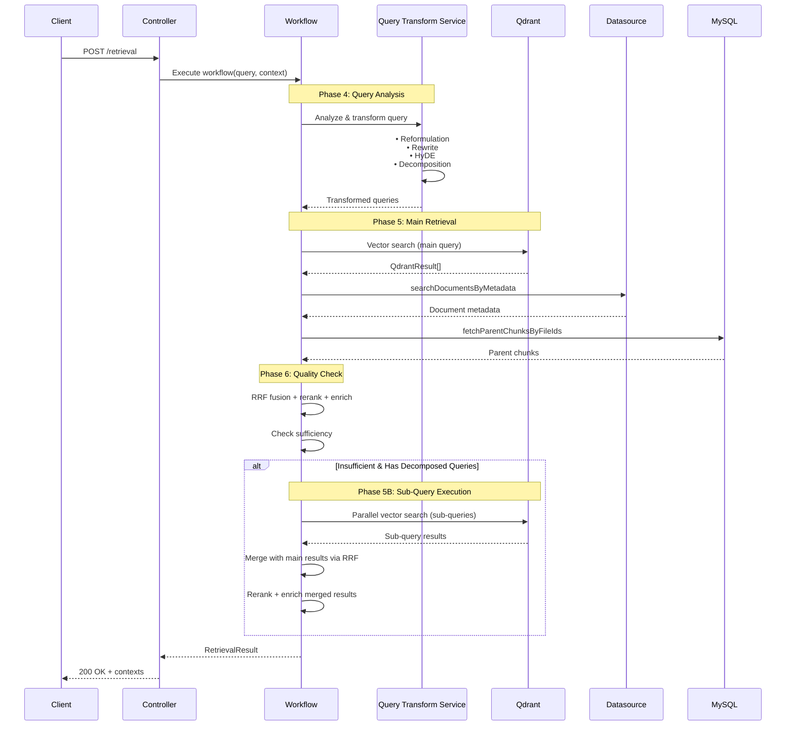
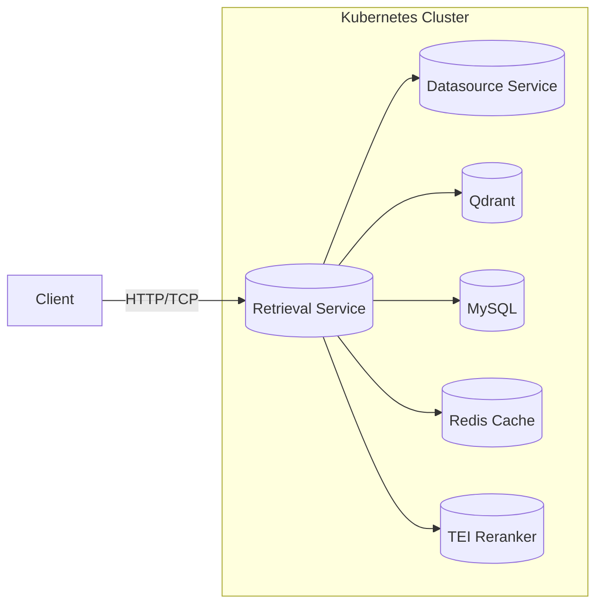

# LTV Assistant Retrieval Service - Architecture Diagrams

> Updated November 2025: The retrieval stack now relies on Qdrant for vector search and MySQL for metadata enrichment.

## 1. Retrieval Workflow (LangGraph State Machine)

## 2. Query Decomposition Execution (Detailed Flow)

## 3. Component Architecture

## 4. Data Flow

## 5. Deployment Topology

